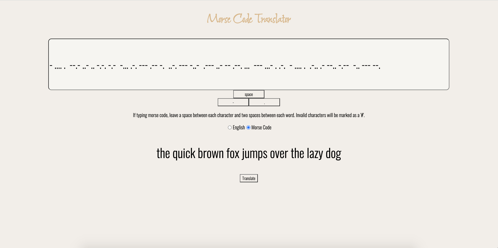

# Morse Code Translator Project

## Description

I undertook this project as part of my _nology web development course to allow me to apply my recent study of object oriented programming and testing.

The website features a simple morse code translator, which allows users to enter in letters from the Latin alphabet and have them translated into morse code as well as vice versa.

The letter and morse code data as well as the methods relating to the data are stored within a class and there are separate validation functions to ensure that only valid characters are translated.

## How to use it

English to morse - Ensuring that the 'English' radio button is selected (it is as default), the user types in their word and hits the 'translate' button. The morse code will appear below.

Morse to English - the user simply selects the 'morse code' selection and enters in the code, ensuring to leave one space between each character and two spaces between each word. 

Alternatively, the user can instead click on the dot, dash or space buttons for these to appear in the input box and a short or longer bleeping sound to replicate the code will be heard. After hitting 'translate', the morse code will then appear in the same spot with a forward slash separating each word.

## Examples
* English to morse  
'sos' translates as '.../---/...'.
 
* English to morse  
'the quick brown fox jumps over the lazy dog' translates as '- .... ./--.- ..- .. -.-. -.-/-... .-. --- .-- -./..-. --- -..-/.--- ..- -- .--. .../--- ...- . .-./- .... ./.-.. .- --.. -.--/-.. --- --.'. 

* Morse to English  
'... --- ...' translates as 'sos'. 

* Morse to English  
'- .... .  --.- ..- .. -.-. -.-  -... .-. --- .-- -.  ..-. --- -..-  .--- ..- -- .--. ...  --- ...- . .-.  - .... .  .-.. .- --.. -.--  -.. --- --.' translates as 'the quick brown fox jumps over the lazy dog'. 

## Testing

The project is split into testable and non-testable files. I have written positive and negative tests for the following methods contained within the 'translator' class:

1. translateEnToMo
2. translateMoToEn
3. changeNumberToWord

I have also created tests for the following functions located outside of the class:

1. validateEnEntry
2. validateMoEntry

## Future adaptations

In future, I would like to create a 'hear morse code' button, which, when clicked, will loop through an array of each morse code character and play the relevant sound. I have created a separate branch to work on this.

## How it looks
